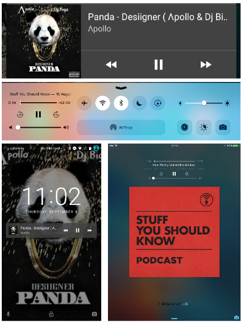

# MediaSession API Explained

## Objectives

People consume a lot of media (audio/video) and the Web is one of the primary
means of consuming this type of content. However, media on the web does not
integrate well with the platform. The MediaSession API helps closing the gap
between the web and native with a particular focus on mobile.

### Allowing pages to specify the currently playing media metadata

As many websites provide media content (eg. a video or audio clip) , they may
want to let the user know what media is currently playing (which is called
**media metadata**). Some sites (YouTube, Soundcloud, etc.) change the page
title to display this info. This work around has limitations when integrating
with the platform, for example there is no way to specify rich metadata like
album title, artist name or album art which can be displayed in platform UI.

The MediaSession API gives pages the ability to specify the metadata of the
currently playing media. The metadata will be passed to the platform, and can be
displayed in media centers, notification, device lockscreen etc. The user then
can observe what is currently playing. Here are some screenshots of
notification, media center and lockscreen for music & podcast applications
take on Android and iOS:



Windows also provides a similar experience via its System Media Transport
Controls. These controls appear on the lockscreen whenever media is playing:


They also appear on the desktop whenever a user interacts with hardware media keys:


### Allowing pages to respond to media controls

Many platforms provide interfaces for native app developers to respond to media
controls, which come from headset buttons, keyboard media buttons, media
centers, etc. It will improve the user experience significantly if web pages can
respond to these controls, especially for commands such as "play/pause",
"previous/next track" and "seek back/forward".

The MediaSession API gives pages the ability to respond to platform media
controls. By implementing the API, the user agent will act as a proxy and
pass the media controls to web pages, so that the pages can perform
corresponding actions.

For example, a podcast website can tell the user agent that it wants to receive
"seek forward/backward" commands, and when the commands are received, the
website changes the playback position accordingly. A music website can tell the
user agent that it wants to receive "previous/next track" commands, so that it
can switch tracks when these commands are received.

## API design

This specification solves the two use cases within the same API because media
metadata and media controls are usually bonded together at least with regards to
UI elements. It is intuitive that a user to control the media whose metadata is
displayed on platform UI. On Android, the
[MediaSession class](https://developer.android.com/reference/android/media/session/MediaSession.html)
both handles media metadata and media controls, while on iOS,
[MPNowPlayingInfoCenter](https://developer.apple.com/library/ios/documentation/MediaPlayer/Reference/MPNowPlayingInfoCenter_Class/)
handles media metadata and
[MPRemoteCommandCenter](https://developer.apple.com/library/ios/documentation/MediaPlayer/Reference/MPRemoteCommandCenter_Ref/)
handles media controls but they are both singletons per application. Besides, it
is still doable if the page truly wants media metadata without media controls or
vice versa.

### The MediaSession interface

The `MediaSession` object is the main interface for this API, which looks like
the following:

```javascript
enum MediaSessionPlaybackState {
  "none",
  "paused",
  "playing"
};

enum MediaSessionAction {
  "play",
  "pause",
  "seekbackward",
  "seekforward",
  "previoustrack",
  "nexttrack",
  "stop",
  "seekto"
};

callback MediaSessionActionHandler = void();

interface MediaSession : EventTarget {
    attribute MediaMetadata? metadata;

    attribute MediaSessionPlaybackState playbackState;  // defaults to "none"

    void setActionHandler(MediaSessionAction action, MediaSessionActionHandler? handler);
    
    void setPositionState(optional MediaPositionState? state);
};
```

### The `MediaMetadata` interface

A `MediaMetadata` object can contain media metadata like title, artist, album
and album art. To set the metadata for a `MediaSession`, the page should create
a `MediaMetadata` object and assign it to a `MediaSession` object:

```javascript
navigator.mediaSession.metadata = new MediaMetadata(/* MediaMetadata constructor */);
```

The `MediaMetadata` interface generally looks like (details are omitted):

```javascript
[Constructor=...]
interface MediaMetadata {
    attribute DOMString title;
    attribute DOMString artist;
    attribute DOMString album;
    attribute FrozenArray<MediaImage> artwork;
};

dictionary MediaImage {
  required USVString src;
  DOMString sizes = "";
  DOMString type = "";
};
```

### The `MediaPositionState` dictionary

The `MediaPositionState` dictionary can contain the current playback position
and duration. To set the position for a `MediaSession`, the page should call
`setPositionState` with a `MediaPositionState` dictionary:

```javascript
navigator.mediaSession.setPositionState({
  duration: 60,
  playbackRate: 2,
  position: 10
});
```

The `MediaPositionState` interface generally looks like (details are omitted):

```javascript
dictionary MediaPositionState {
  double duration;
  double playbackRate;
  double position;
};
```

### Media session actions

The API for media session action work as follows:

* The page registers action handlers for media session actions. A page
  registering an event handler for a media session action implies it supports
  this action.
* If applicable, the user agent displays a UI for these actions.
* If applicable, the user agent registers callbacks for these actions to the
  platform.
* When the user initiates media session actions through UI or platform
  facilities, the user agent forwards the media session action to the page by
  calling the corresponding handler.

It is up to the user agent to decide which actions to show for in the UI and
register listeners to the platform. This may vary depending on UI concerns and
platform capabilities.

The user agent may have default handlers for `play` and `pause` actions but not
for the other actions.

For `play` and `pause` actions, they are usually shown at the same place in the
UI, and the platform sometimes send a joint command for those actions (such as a
headset button click). Therefore, we need to figure out which button to show and
which action handler to call. If the page is currently playing, the `pause`
button should be shown and `pause` action handler should be called when the
joint command is received. If the page is paused, the `play` button should be
shown and `play` action handler should be called when the joint command is
received. The UA must have the ability to determine whether the page is playing
or not. Besides, the `playbackState` will be used as a hint which can override
the playback state determined by the UA, which could be useful when the page
wants to do some preparation steps when the media is paused but it expects the
preparation steps could be interrupted by a `pause` action. For example, when the
page pauses its media and plays a third-party ad in an iframe, the UA might
consider the session as "not playing", however the page wants to allow the user to
pause the ad playback and cancel the pending playback after the ad finishes.

These are some usage examples of media session actions:

Handle media session actions
```javascript
// Suppose |audio| is an audio element.
navigator.mediaSession.setActionHandler("play", _ => audio.play());
navigator.mediaSession.setActionHandler("pause", _ => audio.pause());
navigator.mediaSession.setActionHandler("previoustrack", _ => { audio.src = /* some URL */; });
navigator.mediaSession.setActionHandler("nexttrack", _ => { audio.src = /* some URL */; });
navigator.mediaSession.setActionHandler("stop", _ => { audio.src = ''; });
navigator.mediaSession.setActionHandler("seekto", (e) => { audio.currentTime = e.seekTime; });
```

Use `playbackState` to override the playback state determined by the UA.
```javascript
var adFrame;

// Suppose |audio| is an audio element, and |adFrame| is an iframe for playing ads.
function pauseAudioAndPlayAd() {
  audio.pause();
  navigator.mediaSession.playbackState = "playing";

  setUpAdFrame();
  adFrame.contentWindow.postMessage("play_ad");
  navigator.mediaSession.setActionHandler("pause", pauseAd);
}

function pauseAd() {
  adFrame.contentWindow.postMessage("pause_ad");
  navigator.mediaSession.playbackState = "paused";
  navigator.mediaSession.setActionHandler("play", resumeAd);
}

function resumeAd() {
  adFrame.contentWindow.postMessage("resume_ad");
  navigator.mediaSession.playbackState = "playing";
  navigator.mediaSession.setActionHandler("pause", pauseAd);
}

window.onmessage = function(e) {
  if (e.data === "ad finished") {
    removeAdFrame();
    navigator.mediaSession.playbackState = "none";

    // Recover action handlers to control |audio|
    navigator.mediaSession.setActionHandler("play", audio.play());
    navigator.mediaSession.setActionHandler("pause", audio.pause());
  }
}

function setUpAdFrame() {
  adFrame = document.createElement("iframe");
  adFrame.src = "https://example.com/ad-iframe.html";
  document.body.appendChild(adFrame);
}

function removeAdFrame() {
  adFrame.remove();
}
```

### `MediaSession` routing

It usually makes more sense to display the media metadata of one page and let
only that page respond to media session actions than doing that for multiple
pages at the same time. Since multiple tabs can have `MediaSession` objects, the
user agent should have a routing mechanism to select one `MediaSession`. The
media metadata of the selected `MediaSession` will be passed to the platform for
UI display, and all media session actions are routed to that `MediaSession`. The
user agent should give control to the page or component that is currently
playing the most meaningful media to the user. If the AudioFocus API (see
[below](#sec-audiofocus-api)) is being used, it is defined by the
API. Otherwise, the user agent should route `MediaSession` based on platform
conventions and the preferred user experience.

With regards to frames, the user agent is able to use `MediaSession` information
coming from a frame. It can also be ignored, allowing the user agent to craft a
user experience that they believe would work the best for their users. However,
for privacy purposes, if a frame has audio focus, and its `MediaSession` isn't
used, the action handlers of another frame such as a parent frame should not be
used.

### `MediaSession` as a global instance or a user-constructible object?

The current spec approach is that most websites will only use one `MediaSession`
instance. Given that most browsers will provide a default `MediaSession` for a
page when one is provided, having one entry point for each frame is simpler for
the authors and implementers.

However, the current mechanism could be extended to a more flexible solution
where `MediaSession` can be user-constructible and activated, allowing the
default object hanging from the `navigator` object to be deactivated.

```javascript
[Constructor()]
interface MediaSession {
    attribute MediaMetadata? metadata;
    // ...

    Promise<void> activate();
    void deactivate();
    readonly attribute boolean   active;
    attribute EventHandler       onactivationchange;
};
```

This way, the page can have multiple `MediaSession`s that exist at the same
time, and it needs to activate/deactivate them to indicate which one is in use.
There might be races if multiple `MediaSession`s are active at the same time in
which case, the user agent would decide which one to use (preferably the latest
one becoming active). Note that all this is within a page (tab), and does not
conflict with `MediaSession` routing.

An example is that suppose a video website plays a pre-roll ad before a video
plays, it can create one `MediaSession` for the video and one for the ad. The
page associates the `MediaSession`s to the video/ad state so that the
corresponding `MediaSession` is only active when the video/ad is playing.

The advantage of this solution is that it offers better composability with other
objects, especially `AudioFocusEntry` (from the AudioFocus API) objects. The
lifetime of the `MediaSession`s will be linked to these objects and they can be
activated/deactivated automatically when the associated objects start/stop
playback.

The disadvantage of this solution is that it might make the API complex to use,
and there are still race issues websites need to take care. Also, which is more
important, if the user agent does not have an automatic activation mechanism for
`MediaSession` (for example the AudioFocus API is not implemented), the benefit
will be very low since the solution is essentially equivalent to having multiple
`MediaMetadata` objects and setting different metadata to the global
`MediaSession` instance.

## <a name="sec-audiofocus-api"></a>The AudioFocus API

The MediaSession API previously has an audio focus managing mechanism. Audio
focus management has moved into a separate API called AudioFocus API, which is
still work in progress. The reason for moving the AudioFocus API out are as
follows:

* The AudioFocus API is less useful, and the current behavior is usually fine
  for rich media.
* The AudioFocus API is less mature but much more complex with a number of
  issues.
    * The AudioFocus API has possible compatibility issues with different
      platform.
    * Different audio sources have different restrictions and some audio sources
      can't easily be interrupted (Web Audio, WebRTC, ...).
    * If some websites do not use the AudioFocus API, a good fallback behavior
      still needs to be investigated.

In general, the AudioFocus API improves audio mixing between web pages and
native applications on the platform. The AudioFocus API will provide
AudioFocusEntry interface. A web page can create AudioFocusEntry objects
specifying how they should be mixed with other AudioFocusEntrys or native
applications. The page can then adds audio-producing objects to the
AudioFocusEntry, and it needs to request audio focus when it wants to produce
audio and abandon audio focus when playback stops. The user agent will then
handle the audio mixing between web pages and native applications.

The AudioFocus API can interact with the MediaSession API in `MediaSession`
routing. It will also help in automatic `MediaSession` activation/deactivation
as well for the "`MediaSession` as a user-constructible object" solution.
